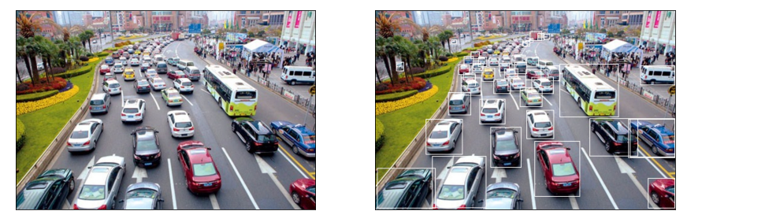

# Faster RCNN torchvision implemetation

Vehicules detection based on Faster RCNN Torchvision implementation

## Results preview

## References:

Torchvision (computer vision PyTorch package): <a href="https://pytorch.org/vision/stable/models.html">Torchvision</a>

Paper: <a href="https://arxiv.org/abs/1506.01497"> Faster R-CNN: Towards Real-Time Object Detection with Region Proposal Networks</a>
